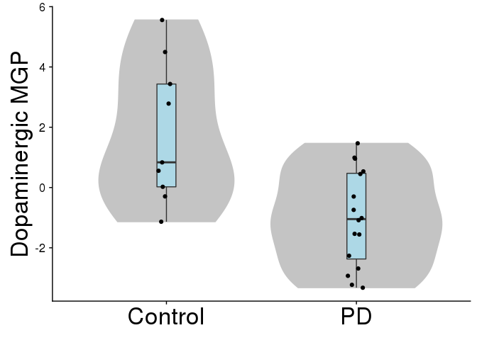
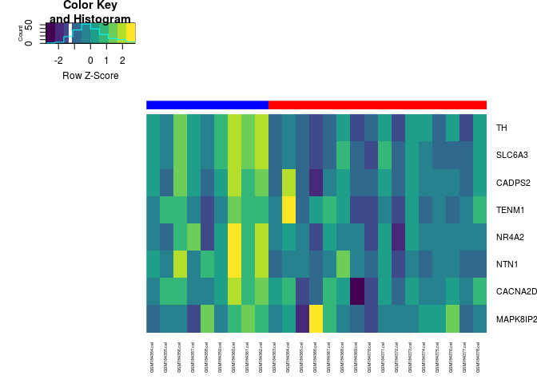
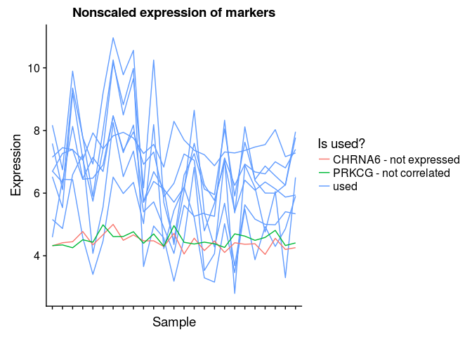

[](https://travis-ci.org/oganm/markerGeneProfile)[](https://codecov.io/gh/oganm/markerGeneProfile)

markerGeneProfile
=================

This package includes functions responsible for marker gene selection and marker gene profile estimation estimation as described in Mancarci et al. 2017. It also includes a copy of mouse brain cell type markers from the [neuroExpressoAnalysis](https://github.com/oganm/neuroExpressoAnalysis) package for convenience along with mock data for easy testing.

-   [markerGeneProfile](#markergeneprofile)
-   [Table of Contents](#table-of-contents)
-   [Installation](#installation)
-   [Usage](#usage)
    -   [Marker genes](#marker-genes)
        -   [Sample data for marker gene selection](#sample-data-for-marker-gene-selection)
        -   [Selection of marker genes](#selection-of-marker-genes)
        -   [Better selection of marker genes](#better-selection-of-marker-genes)
    -   [Marker gene profiles (MGP)](#marker-gene-profiles-mgp)
        -   [Sample data for MGP estimation](#sample-data-for-mgp-estimation)
        -   [MGP estimation](#mgp-estimation)

Installation
============

Use devtools to install. Additional github packages needs to be installed for it work.

    devtools::install_github('oganm/markerGeneProfile')

In this document additional packages are used that are not package dependencies

    install.packages(ggplot2)
    install.packages(gplots)
    install.packages(viridis)
    install.packages(dplyr)

Usage
=====

Marker genes
------------

A list of marker genes specific to or enriched in a cell type is required in order to estimate cell type profiles. In this package, a copy of mouse brain cell type-specific markers from [neuroExpressoAnalysis](https://github.com/oganm/neuroExpressoAnalysis), the package that summarizes the entire analysis performed in Mancarci et al. 2017 is included (`mouseMarkerGenes`). If an different marker gene set is needed, steps outlined below can be followed to create one from a new dataset.

### Sample data for marker gene selection

This package includes a sample cell type-specific transcriptomic dataset representing expression profiles from multiple purified cell types aimed to demonstrate the minimal information required for the selection of marker genes.

`mgp_sampleProfilesMeta` includes the basic metadata required for the cell type specific expression dataset.

``` r
data(mgp_sampleProfilesMeta)
kable(head(mgp_sampleProfilesMeta))
```

| sampleName |  replicate|  PMID| CellType | region   | RegionToParent | RegionToChildren |
|:-----------|----------:|-----:|:---------|:---------|:---------------|:-----------------|
| Sample01   |          1|     1| Cell A   | Region 1 | TRUE           | TRUE             |
| Sample02   |          1|     1| Cell A   | Region 1 | TRUE           | TRUE             |
| Sample03   |          1|     1| Cell A   | Region 1 | TRUE           | TRUE             |
| Sample04   |          2|     2| Cell A   | Region 1 | TRUE           | TRUE             |
| Sample05   |          2|     2| Cell A   | Region 1 | TRUE           | TRUE             |
| Sample06   |          2|     2| Cell A   | Region 1 | TRUE           | TRUE             |

**sampleName:** name of the samples. This needs to correspond to column names in the expression file.

**replicate:** A vector marking which samples are replicates of each other.

**PMID: ** A vector marking which samples come from the same study. Normally taking PMIDs of the papers is a good idea.

**CellType:** A vector marking the cell types that the samples represent.

**region:** The regions samples are extracted from. Only needed if region specific genes are to be selected.

**RegionToParent:** If region specific genes are to be selected and a region hierarchy is to be used, this column controls whether or not the sample should be included in the parent regions of the indicated region. If not provided it will default to `TRUE`. The name of this column is hard coded and should not be changed.

**RegionToChildren:** Same as above except it controls if the sample should be included in the children regions. If not provided it will default to `TRUE`. The name of this column is hard coded and should not be changed.

`mgp_sampleProfiles` is a sample expression data. **Gene.Symbol** column is the gene identifier that should be composed of unique IDs while the rest are sample names that corresponds to the relevant column in the metadata file. Other columns can be present before the sample data but they should not be of class `double`.

``` r
data(mgp_sampleProfiles)
kable(mgp_sampleProfiles)
```

| Gene.Symbol |  Sample01|  Sample02|  Sample03|  Sample04|  Sample05|  Sample06|  Sample07|  Sample08|  Sample09|  Sample10|  Sample11|  Sample12|  Sample13|  Sample14|  Sample15|  Sample16|  Sample17|  Sample18|
|:------------|---------:|---------:|---------:|---------:|---------:|---------:|---------:|---------:|---------:|---------:|---------:|---------:|---------:|---------:|---------:|---------:|---------:|---------:|
| Gene1       |        16|        16|        16|        16|        16|        16|         1|         1|         1|         1|         1|         1|         1|         1|         1|         1|         1|         1|
| Gene2       |         1|         1|         1|         1|         1|         1|        16|        16|        16|        16|        16|        16|         1|         1|         1|         1|         1|         1|
| Gene3       |         1|         1|         1|         1|         1|         1|         1|         1|         1|         1|         1|         1|        16|        16|        16|        16|        16|        16|
| Gene4       |         1|         1|         1|         1|         1|         1|         1|         1|         1|         1|         1|         1|        13|        13|        13|        13|        13|        13|
| Gene5       |         1|         1|         1|         1|         1|         1|         1|         1|         1|         1|         1|         1|         9|         9|         9|         9|         9|         9|
| Gene6       |         1|         1|         1|         1|         1|         1|         1|         1|         1|         1|         1|         1|         7|         7|         7|         7|         7|         7|

`mpg_sampleRegionHiearchy` is a sample region hiearchy. It is a nested named list.

``` r
data(mpg_sampleRegionHiearchy)
mpg_sampleRegionHiearchy
```

    ## $All
    ## $All$`Region 1`
    ## [1] ""
    ## 
    ## $All$`Region 2`
    ## [1] ""

``` r
ogbox::nametree(mpg_sampleRegionHiearchy)
```

    ## All
    ## ├──Region 1
    ## └──Region 2

In this example `Region 1` and `Region 2` are subsets of `All` region

### Selection of marker genes

Marker gene selection is performed using three functions: `markerCandidates`, `pickMarkers` and `rotateSelect`. By default `markerCandidates` will return files for each cell type in a region that lists the gene that are above a given silhouette and fold change thresholds. Other variables are briefly explained below but see the package documentation for in depth explanations

``` r
markerCandidates(design = mgp_sampleProfilesMeta, # the design file
                 expression = mgp_sampleProfiles, # expression file 
                 outLoc = 'README_files/quickSelection', # output directory
                 groupNames = 'CellType', # name of the column with cell types. can be a vector
                 regionNames = 'region', # name of the column with brain regions. leave NULL if no region seperation is desired
                 PMID = 'PMID', # name of the column with study identifiers
                 sampleName = 'sampleName', # name of the column with sample names
                 replicates = 'replicate', # name of the column with replicates
                 foldChangeThresh = 10, # threshold of fold change for gene selection (default is 10)
                 minimumExpression = 8, # minimum expression level that a gene can be considered a marker gene (default is 8)
                 background = 6, # background level of expression (default is 6)
                 regionHierarchy = mpg_sampleRegionHiearchy, # hierarchy of brain regions to be used
                 geneID = 'Gene.Symbol', # column name with with gene idenditifers
                 cores = 16 # number of cores to use in parallelization 
                 )
```

    ## [1] "max cores exceeded"
    ## [1] "set core no to 8"

This creates 3 directories in the output directory

``` r
list.files('README_files/quickSelection')
```

    ## [1] "All_CellType"      "CellType"          "Region 2_CellType"

The `CellType` directory is a list of marker genes that disregards all region specifications (redundant with `All_CellType` in this case) while `Region 2_CellType` and `All_CellType` directories inlcude cell types from the relevant region. Note the absence of `Region 1_CellType` since that region only has a single cell type.

``` r
read.table('README_files/quickSelection/All_CellType/Cell C') %>% kable
```

| V1    |   V2|   V3|   V4|
|:------|----:|----:|----:|
| Gene3 |   15|    1|    1|
| Gene4 |   12|    1|    1|
| Gene5 |    8|    1|    1|

This file shows the candidate genes for cell type `Cell C` in region `All`. The first column is the gene identifier, the second is change in expression in log\_2 scale and the third one is the silhouette coefficient. Note that `Gene6` is absent since its expression level was below the minimum level allowed. `markerCandidates` function does not apply a threshold for silhouette coefficient it also doesn't check to see if a gene satisfies fold change threshold for multiple genes. `pickMarkers` function does that.

``` r
pickMarkers('README_files/quickSelection/All_CellType/',
            foldChange = 1,  # this is a fixed fold change threshold that ignores some leniency that comes from markerCandidates. setting it to 1 makes it irrelevant
            silhouette = 0.5)
```

    ## $`Cell A`
    ## [1] "Gene1"
    ## 
    ## $`Cell B`
    ## [1] "Gene2"
    ## 
    ## $`Cell C`
    ## [1] "Gene3" "Gene4" "Gene5"

If all genes for all regions needs to be seen

``` r
pickMarkersAll('README_files/quickSelection',
               foldChange = 1,
               silhouette = 0.5)
```

    ## $All_CellType
    ## $All_CellType$`Cell A`
    ## [1] "Gene1"
    ## 
    ## $All_CellType$`Cell B`
    ## [1] "Gene2"
    ## 
    ## $All_CellType$`Cell C`
    ## [1] "Gene3" "Gene4" "Gene5"
    ## 
    ## 
    ## $CellType
    ## $CellType$`Cell A`
    ## [1] "Gene1"
    ## 
    ## $CellType$`Cell B`
    ## [1] "Gene2"
    ## 
    ## $CellType$`Cell C`
    ## [1] "Gene3" "Gene4" "Gene5"
    ## 
    ## 
    ## $`Region 2_CellType`
    ## $`Region 2_CellType`$`Cell B`
    ## [1] "Gene2"
    ## 
    ## $`Region 2_CellType`$`Cell C`
    ## [1] "Gene3" "Gene4" "Gene5"

### Better selection of marker genes

The above method is a quick way to pick markers but it does not handle bimodality in expression distribution well. To ensure robustness of the results it is better to perform multiple selections with permutations. `markerCandidates` function has variables to handle permutations for you. `rotate` controls what is the percentage of samples that should be removed every time. seed controls the random seed and is there to ensure reproducibility.

``` r
for (i in 1:10){
    markerCandidates(design = mgp_sampleProfilesMeta, # the design file
                     expression = mgp_sampleProfiles, # expression file 
                     outLoc = file.path('README_files/Rotation',i), # output directory
                     groupNames = 'CellType', # name of the column with cell types. can be a vector
                     regionNames = 'region', # name of the column with brain regions. leave NULL if no region seperation is desired
                     PMID = 'PMID', # name of the column with study identifiers
                     sampleName = 'sampleName', # name of the column with sample names
                     replicates = 'replicate', # name of the column with replicates
                     foldChangeThresh = 10, # threshold of fold change for gene selection (default is 10)
                     minimumExpression = 8, # minimum expression level that a gene can be considered a marker gene (default is 8)
                     background = 6, # background level of expression (default is 6)
                     regionHierarchy = mpg_sampleRegionHiearchy, # hierarchy of brain regions to be used
                     geneID = 'Gene.Symbol', # column name with with gene idenditifers
                     cores = 16, # number of cores to use in parallelization 
                     rotate = 0.33,
                     seed = i
    )
}
```

This creates multiple selection directories. `rotateSelect` can be used to count the number of times a gene is selected for each cell type in each region. This creates another directory similar to the output of `markerCandidates`. Again, valid markers can be acquired using `pickMarkers`

``` r
rotateSelect(rotationOut='README_files/Rotation',
                 rotSelOut='README_files/RotSel',
                 cores = 16,
                 foldChange = 1 # this is a fixed fold change threshold that ignores some leniency that comes from markerCandidates. setting it to 1 makes it irrelevant
             )
```

``` r
pickMarkers('README_files/RotSel/All_CellType/',rotationThresh = 0.95)
```

    ## $`Cell A`
    ## [1] "Gene1"
    ## 
    ## $`Cell B`
    ## [1] "Gene2"
    ## 
    ## $`Cell C`
    ## [1] "Gene3" "Gene4" "Gene5"

``` r
pickMarkersAll('README_files/RotSel',rotationThresh = 0.95)
```

    ## $All_CellType
    ## $All_CellType$`Cell A`
    ## [1] "Gene1"
    ## 
    ## $All_CellType$`Cell B`
    ## [1] "Gene2"
    ## 
    ## $All_CellType$`Cell C`
    ## [1] "Gene3" "Gene4" "Gene5"
    ## 
    ## 
    ## $CellType
    ## $CellType$`Cell A`
    ## [1] "Gene1"
    ## 
    ## $CellType$`Cell B`
    ## [1] "Gene2"
    ## 
    ## $CellType$`Cell C`
    ## [1] "Gene3" "Gene4" "Gene5"
    ## 
    ## 
    ## $`Region 2_CellType`
    ## $`Region 2_CellType`$`Cell B`
    ## [1] "Gene2"
    ## 
    ## $`Region 2_CellType`$`Cell C`
    ## [1] "Gene3" "Gene4" "Gene5"

Marker gene profiles (MGP)
--------------------------

### Sample data for MGP estimation

The package includes mouse brain cell type markers published in Mancarci et al. 2017 and gene expression data from substantia nigra samples from healthy donors and Parkinson's disease patients by [Lesnick et al. 2007](https://www.ncbi.nlm.nih.gov/geo/query/acc.cgi?acc=GSE7621).

Mouse marker genes is available in `mouseMarkerGenes` object as a nested list.

``` r
data(mouseMarkerGenes)
names(mouseMarkerGenes)
```

    ##  [1] "All"             "Amygdala"        "BasalForebrain" 
    ##  [4] "Brainstem"       "Cerebellum"      "Cerebrum"       
    ##  [7] "Cortex"          "Hippocampus"     "LocusCoeruleus" 
    ## [10] "Midbrain"        "SpinalCord"      "Striatum"       
    ## [13] "Subependymal"    "SubstantiaNigra" "Thalamus"

``` r
lapply(mouseMarkerGenes$Midbrain[1:3],head, 14)
```

    ## $Astrocyte
    ##  [1] "Aass"     "Acsbg1"   "Acsl6"    "Acss1"    "Add3"     "Adhfe1"  
    ##  [7] "AI464131" "Aldh1l1"  "Aldh6a1"  "Antxr1"   "Aox1"     "Apoe"    
    ## [13] "Aqp4"     "Axl"     
    ## 
    ## $BrainstemCholin
    ##  [1] "2310030G06Rik" "Anxa2"         "Cabp1"         "Calca"        
    ##  [5] "Calcb"         "Cd24a"         "Cd55"          "Cda"          
    ##  [9] "Chodl"         "Ecel1"         "Fxyd7"         "Hebp2"        
    ## [13] "Hspb1"         "Hspb8"        
    ## 
    ## $Dopaminergic
    ##  [1] "Cacna2d2" "Cadps2"   "Chrna6"   "Mapk8ip2" "Nr4a2"    "Ntn1"    
    ##  [7] "Prkcg"    "Rian"     "Scn2a"    "Slc6a3"   "Snhg11"   "Tenm1"   
    ## [13] "Th"       "Zim3"

Available Lesnick et al. data is stored in `mgp_LesnickParkinsonsExp` and `mgp_LesnickParkinsonsMeta` objects

``` r
library(dplyr)
```

    ## 
    ## Attaching package: 'dplyr'

    ## The following objects are masked from 'package:stats':
    ## 
    ##     filter, lag

    ## The following objects are masked from 'package:base':
    ## 
    ##     intersect, setdiff, setequal, union

``` r
data(mgp_LesnickParkinsonsExp)
mgp_LesnickParkinsonsExp %>%
    dplyr::select(-GeneNames) %>%
    head %>% {.[,1:6]}
```

    ##           Probe Gene.Symbol   NCBIids GSM184354.cel GSM184355.cel
    ## 43955 1007_s_at        DDR1       780     10.236880      9.891552
    ## 2278    1053_at        RFC2      5982      5.421790      5.280541
    ## 45312    117_at HSPA6|HSPA7 3310|3311      5.164445      4.651754
    ## 43710    121_at        PAX8      7849      7.076004      7.035090
    ## 13573 1255_g_at      GUCA1A      2978      3.107388      3.418976
    ## 21022   1294_at        UBA7      7318      6.644858      6.182664
    ##       GSM184356.cel
    ## 43955     10.498371
    ## 2278       5.852467
    ## 45312      4.729189
    ## 43710      6.698765
    ## 13573      3.491832
    ## 21022      5.982642

``` r
data(mgp_LesnickParkinsonsMeta)
mgp_LesnickParkinsonsMeta %>% head
```

    ##         GSM disease
    ## 1 GSM184354 Control
    ## 2 GSM184355 Control
    ## 3 GSM184356 Control
    ## 4 GSM184357 Control
    ## 5 GSM184358 Control
    ## 6 GSM184359 Control

Before MGP estimation, it is important to filter expression data of low expressed genes and make sure all genes are represented only once in the dataset. While there are many probeset summarization and methods, for this work we chose the most variable probeset and remove all probes with a maximum expression below the median

``` r
unfilteredParkinsonsExp = mgp_LesnickParkinsonsExp # keep this for later
medExp = mgp_LesnickParkinsonsExp %>% 
    ogbox::sepExpr() %>% {.[[2]]} %>%
    unlist %>% median

# mostVariable function is part of this package that does probe selection and filtering for you
mgp_LesnickParkinsonsExp = mostVariable(mgp_LesnickParkinsonsExp,
                                        threshold = medExp, 
                                        threshFun= median)
```

### MGP estimation

MGPs are simply the first principal component of marker gene expression. This method of marker gene profile estimation is similar to the methodology of multiple previous works that aim to estimate relative abundance of cell types in a whole tissue sample (Chikina et al., 2015; Westra et al., 2015; Xu et al., 2013).

Primary function that deals with MGP estimation is `mgpEstimate`. This function will take in expression data and marker gene lists to return MGPs. `exprData` is the expression matrix which should include gene identifiers as a column. Other columns can be present at the beginning of the data frame but should not be of class `double`. `genes` is the list of markers. It is assumed to be a list of character vectors, each vector containing gene names for a cell type. `geneColName` is the name of the column where gene names are found. `geneTransform` is a function that will be applied to the gene names provided in `genes`. Note that this by default tranforms mouse gene names to human gene names. Set it to NULL if this is not desired.

Below a basic estimation performed with other important variables briefly explained.

``` r
estimations =  mgpEstimate(exprData=mgp_LesnickParkinsonsExp,
                           genes=mouseMarkerGenes$Midbrain,
                           geneColName='Gene.Symbol',
                           outlierSampleRemove=F, # should outlier samples removed. This is done using boxplot stats.
                           geneTransform =function(x){homologene::mouse2human(x)$humanGene}, # this is the default option for geneTransform
                           groups=mgp_LesnickParkinsonsMeta$disease, #if there are experimental groups provide them here. if not desired set to NULL
                           seekConsensus = FALSE, # ensures gene rotations are positive in both of the groups
                           removeMinority = TRUE) # removes genes if they are the minority in terms of rotation sign from estimation process
```

Dopamine rgic cell loss is a known effect of Parkinson's Disease. To see if this effect can be observed we can look at dopaminergic MGPs in healthy donors vs Parkinson's Disease patients

``` r
library(ggplot2)

ls(estimations)
```

    ## [1] "estimates"                "fullPCAs"                
    ## [3] "groups"                   "meanUsedMarkerExpression"
    ## [5] "removedMarkerRatios"      "rotations"               
    ## [7] "simpleScaledEstimation"   "trimmedPCAs"             
    ## [9] "usedMarkerExpression"

``` r
ls(estimations$estimates)
```

    ## [1] "Astrocyte"              "BrainstemCholin"       
    ## [3] "Dopaminergic"           "Microglia"             
    ## [5] "Microglia_activation"   "Microglia_deactivation"
    ## [7] "Oligo"                  "Serotonergic"

``` r
dopaminergicFrame =
    data.frame(`Dopaminergic MGP` = estimations$estimates$Dopaminergic, 
               state = estimations$groups$Dopaminergic, # note that unless outlierSampleRemove is TRUE this will be always the same as the groups input
               check.names=FALSE)

ggplot2::ggplot(dopaminergicFrame, 
                aes(x = state, y = `Dopaminergic MGP`)) + 
    ogbox::geom_ogboxvio() + geom_jitter(width = .05) # this is just a convenience function that outputs a list of ggplot elements.
```



To see if the difference between the two groups is statistically significant we use wilcoxon test (Mann-Whitney test). Wilcoxon-test is a non parametric tests that does not make assumptions about the distribution of the data. We chose to use it because marker gene profiles are not normally distributed.

``` r
group1 = estimations$estimates$Dopaminergic[estimations$groups$Dopaminergic %in% "Control"]
group2 = estimations$estimates$Dopaminergic[estimations$groups$Dopaminergic %in% "PD"]
wilcox.test(group1,group2)
```

    ## 
    ##  Wilcoxon rank sum test
    ## 
    ## data:  group1 and group2
    ## W = 119, p-value = 0.006547
    ## alternative hypothesis: true location shift is not equal to 0

Based on these results we can say that there is indeed a significant difference between doparminergic marker gene profiles between control and parkinson's disease patients.

This difference can be also observed by looking at gene expression of markers

``` r
estimations$usedMarkerExpression$Dopaminergic%>%
    as.matrix %>%
    gplots::heatmap.2(trace = 'none',
                      scale='row',Rowv = FALSE,Colv = FALSE, dendrogram = 'none',
                      col= viridis::viridis(10),cexRow = 1, cexCol = 0.5,
                      ColSideColors = estimations$groups$Dopaminergic %>% 
                          ogbox::toColor(palette = c('Control' = 'blue',
                                                     "PD" = "red")) %$% cols ,
                      margins = c(5,5))
```



Indeed in general most marker genes have a high expression is control samples which are shown in green.

It is important to note that not all marker genes are used in the estimation of marker gene profiles. Below we see all genes that are identified as dopaminergic cell markers with human orthologues. Yet not all these genes appear in the heatmap above

``` r
mouseHumanGeneTable = mouseMarkerGenes$Midbrain$Dopaminergic %>% homologene::mouse2human()
allHumanDopaGenes = mouseHumanGeneTable %$% humanGene
mouseHumanGeneTable
```

    ##    mouseGene humanGene
    ## 1   Cacna2d2  CACNA2D2
    ## 2     Cadps2    CADPS2
    ## 3     Chrna6    CHRNA6
    ## 4   Mapk8ip2  MAPK8IP2
    ## 5      Nr4a2     NR4A2
    ## 6       Ntn1      NTN1
    ## 7      Prkcg     PRKCG
    ## 8     Slc6a3    SLC6A3
    ## 9      Tenm1     TENM1
    ## 10        Th        TH

Some of these genes are removed because they are not included in our dataset, either because they are not in the platform, or because the gene was filtered in the pre-processing stage due to low expression.

``` r
allHumanDopaGenes[!allHumanDopaGenes %in% mgp_LesnickParkinsonsExp$Gene.Symbol]
```

    ## [1] "CHRNA6"

``` r
allGenes = allHumanDopaGenes[allHumanDopaGenes %in% mgp_LesnickParkinsonsExp$Gene.Symbol]
```

Other genes can be removed because mgpEstimate thinks they don't correlate well with the rest of the genes. Details of this process can be found in Mancarci et al. 2017 manuscript

``` r
allGenes[!allGenes %in% rownames(estimations$usedMarkerExpression$Dopaminergic)]
```

    ## [1] "PRKCG"

``` r
genesUsed =  rownames(estimations$usedMarkerExpression$Dopaminergic)
```

By looking at the unfiltered expression data, we can see how these two genes were unsuitable for MGP estimation

``` r
toPlot = 
    unfilteredParkinsonsExp[unfilteredParkinsonsExp$Gene.Symbol %in%
                                     homologene::mouse2human(mouseMarkerGenes$Midbrain$Dopaminergic)$humanGene,] %>%
    mostVariable(threshold = 0) 

toPlot %>%
    mostVariable(threshold = 0) %>% 
    ogbox::sepExpr() %>%
    {.[[2]]} %>% as.matrix() %>% 
    apply(1,function(x){ogbox::scale01(x)}) %>%
    t %>%
    {rownames(.) = 
        toPlot$Gene.Symbol[toPlot$Gene.Symbol %in% 
                               homologene::mouse2human(mouseMarkerGenes$Midbrain$Dopaminergic)$humanGene];.} %>%
    reshape2::melt() %>% 
    {colnames(.) = c('Gene','Sample','Expression');.} %>% 
    dplyr::mutate(`Is used?` = rep('used',length(Gene)) %>%
                      {.[Gene %in% 'CHRNA6'] = '(CHRNA6) not expressed';.[Gene %in% 'PRKCG'] = '(PRKCG) not correlated';.}) %>% 
    ggplot(aes(y = Expression, x = Sample, group = Gene, color = `Is used?`)) + 
    geom_line() + 
    cowplot::theme_cowplot() +
    theme( axis.text.x= element_blank()) + 
    ggtitle('Scaled expression of markers')
```


``` r
toPlot %>%
    mostVariable(threshold = 0) %>% 
    ogbox::sepExpr() %>%
    {.[[2]]} %>% as.matrix()%>%
    {rownames(.) = 
        toPlot$Gene.Symbol[toPlot$Gene.Symbol %in% 
                               homologene::mouse2human(mouseMarkerGenes$Midbrain$Dopaminergic)$humanGene];.} %>%
    reshape2::melt() %>% 
    {colnames(.) = c('Gene','Sample','Expression');.} %>% 
    dplyr::mutate(`Is used?` = rep('used',length(Gene)) %>%
                      {.[Gene %in% 'CHRNA6'] = 'CHRNA6 - not expressed';.[Gene %in% 'PRKCG'] = 'PRKCG - not correlated';.}) %>% 
    ggplot(aes(y = Expression, x = Sample, group = Gene, color = `Is used?`)) + 
    geom_line() + 
    cowplot::theme_cowplot() +
    theme( axis.text.x= element_blank()) + 
    ggtitle('Nonscaled expression of markers')
```



Both of these genes seem to be non-expressed though PRKCG managed to be just above the removal threshold. Luckily lack of correlation reveals that it is not behaving as other marker genes.

The ratio of `genesUsed` and `allGenes` (all markers available in the study) can be used as a confidence metric. If a significant portion of the genes do not correlate well with each other that may point to presence of non cell type specific signal (regulation or noise). For all cell types this ratio is outputted. You'll see a warning if this ratio ever exceeds 0.4

``` r
estimations$removedMarkerRatios
```

    ##              Astrocyte        BrainstemCholin           Dopaminergic 
    ##             0.12962963             0.37500000             0.11111111 
    ##              Microglia   Microglia_activation Microglia_deactivation 
    ##             0.09649123             0.08219178             0.10909091 
    ##                  Oligo           Serotonergic 
    ##             0.05882353             0.00000000

The ratio for dopaminergic cells is fairly low. We can also look at the amount of varience explained in the first PC of marker gene expression. If this value is low, it can point to higher amounts of confounding noise or regulation.

``` r
estimations$trimmedPCAs$Dopaminergic %>% summary()
```

    ## Importance of components%s:
    ##                           PC1    PC2     PC3     PC4     PC5     PC6
    ## Standard deviation     2.3056 1.0829 0.87149 0.53287 0.45796 0.38075
    ## Proportion of Variance 0.6645 0.1466 0.09494 0.03549 0.02622 0.01812
    ## Cumulative Proportion  0.6645 0.8110 0.90597 0.94147 0.96768 0.98580
    ##                            PC7     PC8
    ## Standard deviation     0.28376 0.18177
    ## Proportion of Variance 0.01006 0.00413
    ## Cumulative Proportion  0.99587 1.00000

For instance unlike dopaminergic cells, cholinergic cells seem to have a higher proportion of their marker genes removed. Looking at the variation explained by first PC reveals that first PC only explains 28% of all variance.

``` r
estimations$trimmedPCAs$BrainstemCholin %>% summary()
```

    ## Importance of components%s:
    ##                           PC1    PC2    PC3    PC4    PC5    PC6     PC7
    ## Standard deviation     1.7002 1.3215 1.2445 1.1559 0.8752 0.7804 0.68942
    ## Proportion of Variance 0.2891 0.1746 0.1549 0.1336 0.0766 0.0609 0.04753
    ## Cumulative Proportion  0.2891 0.4637 0.6186 0.7522 0.8288 0.8897 0.93725
    ##                            PC8     PC9    PC10
    ## Standard deviation     0.55879 0.44616 0.34094
    ## Proportion of Variance 0.03122 0.01991 0.01162
    ## Cumulative Proportion  0.96847 0.98838 1.00000

Such a result can occur if

-   Marker genes are highly regulated.
-   There is little difference in cell type proportions or wholescale regulation of marker genes and MGP is driven by noise and other confounds.
