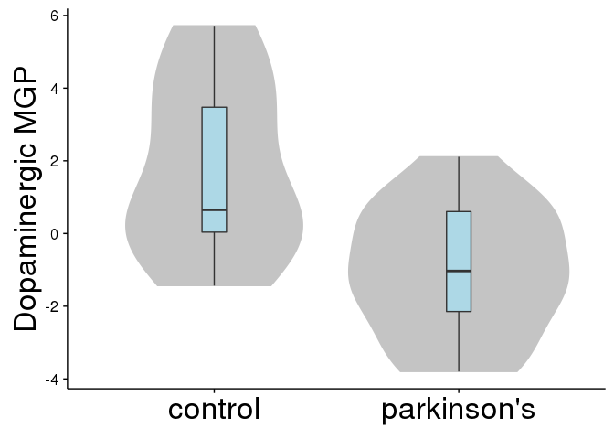

[](https://travis-ci.org/oganm/markerGeneProfile)[](https://codecov.io/gh/oganm/markerGeneProfile)

markerGeneProfile
=================

This package includes functions responsible for marker gene selection and marker gene profile estimation estimation as described in Mancarci et al. 2017. It also includes a copy of mouse brain cell type markers from the [neuroExpressoAnalysis](https://github.com/oganm/neuroExpressoAnalysis) package for convenience along with mock data for easy testing.

-   [markerGeneProfile](#markergeneprofile)
-   [Table of Contents](#table-of-contents)
-   [Installation](#installation)
-   [Usage](#usage)
    -   [Marker genes](#marker-genes)
        -   [Sample data for marker gene selection](#sample-data-for-marker-gene-selection)
        -   [Selection of marker genes](#selection-of-marker-genes)
        -   [Better selection of marker genes](#better-selection-of-marker-genes)
    -   [Marker gene profiles (MGP)](#marker-gene-profiles-mgp)
        -   [Sample data for MGP estimation](#sample-data-for-mgp-estimation)
        -   [MGP estimation](#mgp-estimation)

Installation
============

Use devtools to install. Additional github packages needs to be installed for it work

    devtools::install_github('oganm/homologene')
    devtools::install_github('oganm/ogbox')
    devtools::install_github('oganm/markerGeneProfile')

Usage
=====

Marker genes
------------

A marker gene list is needed in order to estimate cell type profiles. In this package, a copy of mouse brain cell type markers from [neuroExpressoAnalysis](https://github.com/oganm/neuroExpressoAnalysis), the package that summarizes the entire analysis performed in Mancarci et al. 2017 is included (`mouseMarkerGenes`). If an different marker gene set is needed steps below can be followed to create one

### Sample data for marker gene selection

The package includes a sample cell type profile dataset aimed to demonstrate the minimal information required for selection of marker genes.

`mgp_sampleProfilesMeta` includes the basic metadata required for the cell type specific expression dataset.

``` r
kable(head(mgp_sampleProfilesMeta))
```

| sampleName |  replicate|  PMID| CellType | region   | RegionToParent | RegionToChildren |
|:-----------|----------:|-----:|:---------|:---------|:---------------|:-----------------|
| Sample01   |          1|     1| Cell A   | Region 1 | TRUE           | TRUE             |
| Sample02   |          1|     1| Cell A   | Region 1 | TRUE           | TRUE             |
| Sample03   |          1|     1| Cell A   | Region 1 | TRUE           | TRUE             |
| Sample04   |          2|     2| Cell A   | Region 1 | TRUE           | TRUE             |
| Sample05   |          2|     2| Cell A   | Region 1 | TRUE           | TRUE             |
| Sample06   |          2|     2| Cell A   | Region 1 | TRUE           | TRUE             |

**sampleName:** name of the samples. This needs to correspond to column names in the expression file.

**replicate:** A vector marking which samples are replicates of each other.

**PMID: ** A vector marking which samples come from the same study. Normally taking PMIDs of the papers is a good idea.

**CellType:** A vector marking the cell types that the samples represent.

**region:** The regions samples are extracted from. Only needed if region specific genes are to be selected.

**RegionToParent:** If region specific genes are to be selected and a region hierarchy is to be used, this column controls whether or not the sample should be included in the parent regions of the indicated region. If not provided it will default to `TRUE`. The name of this column is hard coded and should not be changed.

**RegionToChildren:** Same as above except it controls if the sample should be included in the children regions. If not provided it will default to `TRUE`. The name of this column is hard coded and should not be changed.

`mgp_sampleProfiles` is a sample expression data. **Gene.Symbol** column is the gene identifier that should be composed of unique IDs while the rest are sample names that corresponds to the relevant column in the metadata file. Other columns can be present before the sample data but they should not be of class `double`.

``` r
kable(mgp_sampleProfiles)
```

| Gene.Symbol |  Sample01|  Sample02|  Sample03|  Sample04|  Sample05|  Sample06|  Sample07|  Sample08|  Sample09|  Sample10|  Sample11|  Sample12|  Sample13|  Sample14|  Sample15|  Sample16|  Sample17|  Sample18|
|:------------|---------:|---------:|---------:|---------:|---------:|---------:|---------:|---------:|---------:|---------:|---------:|---------:|---------:|---------:|---------:|---------:|---------:|---------:|
| Gene1       |        16|        16|        16|        16|        16|        16|         1|         1|         1|         1|         1|         1|         1|         1|         1|         1|         1|         1|
| Gene2       |         1|         1|         1|         1|         1|         1|        16|        16|        16|        16|        16|        16|         1|         1|         1|         1|         1|         1|
| Gene3       |         1|         1|         1|         1|         1|         1|         1|         1|         1|         1|         1|         1|        16|        16|        16|        16|        16|        16|
| Gene4       |         1|         1|         1|         1|         1|         1|         1|         1|         1|         1|         1|         1|        13|        13|        13|        13|        13|        13|
| Gene5       |         1|         1|         1|         1|         1|         1|         1|         1|         1|         1|         1|         1|         9|         9|         9|         9|         9|         9|
| Gene6       |         1|         1|         1|         1|         1|         1|         1|         1|         1|         1|         1|         1|         7|         7|         7|         7|         7|         7|

`mpg_sampleRegionHiearchy` is a sample region hiearchy. It is a nested named list.

``` r
mpg_sampleRegionHiearchy
```

    ## $All
    ## $All$`Region 1`
    ## [1] ""
    ## 
    ## $All$`Region 2`
    ## [1] ""

``` r
ogbox::nametree(mpg_sampleRegionHiearchy)
```

    ## All
    ## ├──Region 1
    ## └──Region 2

In this example `Region 1` and `Region 2` are subsets of `All` region

### Selection of marker genes

Marker gene selection is performed using three functions: `markerCandidates`, `pickMarkers` and `rotateSelect`. By default `markerCandidates` will return files for each cell type in a region that lists the gene that are above a given silhouette and fold change thresholds. Other variables are briefly explained below but see the package documentation for in depth explanations

``` r
markerCandidates(design = mgp_sampleProfilesMeta, # the design file
                 expression = mgp_sampleProfiles, # expression file 
                 outLoc = 'README_files/quickSelection', # output directory
                 groupNames = 'CellType', # name of the column with cell types. can be a vector
                 regionNames = 'region', # name of the column with brain regions. leave NULL if no region seperation is desired
                 PMID = 'PMID', # name of the column with study identifiers
                 sampleName = 'sampleName', # name of the column with sample names
                 replicates = 'replicate', # name of the column with replicates
                 foldChangeThresh = 10, # threshold of fold change for gene selection (default is 10)
                 minimumExpression = 8, # minimum expression level that a gene can be considered a marker gene (default is 8)
                 background = 6, # background level of expression (default is 6)
                 regionHierarchy = mpg_sampleRegionHiearchy, # hierarchy of brain regions to be used
                 geneID = 'Gene.Symbol', # column name with with gene idenditifers
                 cores = 16 # number of cores to use in parallelization 
                 )
```

    ## [1] "max cores exceeded"
    ## [1] "set core no to 8"

This creates 3 directories in the output directory

``` r
list.files('README_files/quickSelection')
```

    ## [1] "All_CellType"      "CellType"          "Region 2_CellType"

The `CellType` directory is a list of marker genes that disregards all region specifications (redundant with `All_CellType` in this case) while `Region 2_CellType` and `All_CellType` directories inlcude cell types from the relevant region. Note the absence of `Region 1_CellType` since that region only has a single cell type.

``` r
read.table('README_files/quickSelection/All_CellType/Cell C') %>% kable
```

| V1    |   V2|   V3|
|:------|----:|----:|
| Gene3 |   15|    1|
| Gene4 |   12|    1|
| Gene5 |    8|    1|

This file shows the candidate genes for cell type `Cell C` in region `All`. The first column is the gene identifier, the second is change in expression in log\_2 scale and the third one is the silhouette coefficient. Note that `Gene6` is absent since its expression level was below the minimum level allowed. `markerCandidates` function does not apply a threshold for silhouette coefficient it also doesn't check to see if a gene satisfies fold change threshold for multiple genes. `pickMarkers` function does that.

``` r
pickMarkers('README_files/quickSelection/All_CellType/',
            foldChange = 1,  # this is a fixed fold change threshold that ignores some leniency that comes from markerCandidates. setting it to 1 makes it irrelevant
            silhouette = 0.5)
```

    ## $`Cell A`
    ## [1] "Gene1"
    ## 
    ## $`Cell B`
    ## [1] "Gene2"
    ## 
    ## $`Cell C`
    ## [1] "Gene3" "Gene4" "Gene5"

If all genes for all regions needs to be seen

``` r
pickMarkersAll('README_files/quickSelection',
               foldChange = 1,
               silhouette = 0.5)
```

    ## $All_CellType
    ## $All_CellType$`Cell A`
    ## [1] "Gene1"
    ## 
    ## $All_CellType$`Cell B`
    ## [1] "Gene2"
    ## 
    ## $All_CellType$`Cell C`
    ## [1] "Gene3" "Gene4" "Gene5"
    ## 
    ## 
    ## $CellType
    ## $CellType$`Cell A`
    ## [1] "Gene1"
    ## 
    ## $CellType$`Cell B`
    ## [1] "Gene2"
    ## 
    ## $CellType$`Cell C`
    ## [1] "Gene3" "Gene4" "Gene5"
    ## 
    ## 
    ## $`Region 2_CellType`
    ## $`Region 2_CellType`$`Cell B`
    ## [1] "Gene2"
    ## 
    ## $`Region 2_CellType`$`Cell C`
    ## [1] "Gene3" "Gene4" "Gene5"

### Better selection of marker genes

The above method is a quick way to pick markers but it does not handle bimodality in expression distribution well. To ensure robustness of the results it is better to perform multiple selections with permutations. `markerCandidates` function has variables to handle permutations for you. `rotate` controls what is the percentage of samples that should be removed every time. seed controls the random seed and is there to ensure reproducibility.

``` r
for (i in 1:10){
    markerCandidates(design = mgp_sampleProfilesMeta, # the design file
                     expression = mgp_sampleProfiles, # expression file 
                     outLoc = file.path('README_files/Rotation',i), # output directory
                     groupNames = 'CellType', # name of the column with cell types. can be a vector
                     regionNames = 'region', # name of the column with brain regions. leave NULL if no region seperation is desired
                     PMID = 'PMID', # name of the column with study identifiers
                     sampleName = 'sampleName', # name of the column with sample names
                     replicates = 'replicate', # name of the column with replicates
                     foldChangeThresh = 10, # threshold of fold change for gene selection (default is 10)
                     minimumExpression = 8, # minimum expression level that a gene can be considered a marker gene (default is 8)
                     background = 6, # background level of expression (default is 6)
                     regionHierarchy = mpg_sampleRegionHiearchy, # hierarchy of brain regions to be used
                     geneID = 'Gene.Symbol', # column name with with gene idenditifers
                     cores = 16, # number of cores to use in parallelization 
                     rotate = 0.33,
                     seed = i
    )
}
```

This creates multiple selection directories. `rotateSelect` can be used to count the number of times a gene is selected for each cell type in each region. This creates another directory similar to the output of `markerCandidates`. Again, valid markers can be acquired using `pickMarkers`

``` r
rotateSelect(rotationOut='README_files/Rotation',
                 rotSelOut='README_files/RotSel',
                 cores = 16,
                 foldChange = 1 # this is a fixed fold change threshold that ignores some leniency that comes from markerCandidates. setting it to 1 makes it irrelevant
             )
```

``` r
pickMarkers('README_files/RotSel/All_CellType/',rotationThresh = 0.95)
```

    ## $`Cell A`
    ## [1] "Gene1"
    ## 
    ## $`Cell B`
    ## [1] "Gene2"
    ## 
    ## $`Cell C`
    ## [1] "Gene3" "Gene4" "Gene5"

``` r
pickMarkersAll('README_files/RotSel',rotationThresh = 0.95)
```

    ## $All_CellType
    ## $All_CellType$`Cell A`
    ## [1] "Gene1"
    ## 
    ## $All_CellType$`Cell B`
    ## [1] "Gene2"
    ## 
    ## $All_CellType$`Cell C`
    ## [1] "Gene3" "Gene4" "Gene5"
    ## 
    ## 
    ## $CellType
    ## $CellType$`Cell A`
    ## [1] "Gene1"
    ## 
    ## $CellType$`Cell B`
    ## [1] "Gene2"
    ## 
    ## $CellType$`Cell C`
    ## [1] "Gene3" "Gene4" "Gene5"
    ## 
    ## 
    ## $`Region 2_CellType`
    ## $`Region 2_CellType`$`Cell B`
    ## [1] "Gene2"
    ## 
    ## $`Region 2_CellType`$`Cell C`
    ## [1] "Gene3" "Gene4" "Gene5"

Marker gene profiles (MGP)
--------------------------

### Sample data for MGP estimation

The package includes mouse brain cell type markers published in Mancarci et al. 2017 and gene expression data from substantia nigra samples from healthy donors and Parkinson's disease patients by [Lesnick et al. 2007](https://www.ncbi.nlm.nih.gov/geo/query/acc.cgi?acc=GSE7621). Lesnick et al. data available in this package is a subset of the whole expression matrix which only includes cell type markers from the midbrain to reduce the size of the package.

Mouse marker genes is available in `mouseMarkerGenes` object as a nested list.

``` r
names(mouseMarkerGenes)
```

    ##  [1] "All"             "Amygdala"        "BasalForebrain" 
    ##  [4] "Brainstem"       "Cerebellum"      "Cerebrum"       
    ##  [7] "Cortex"          "Hippocampus"     "LocusCoeruleus" 
    ## [10] "Midbrain"        "SpinalCord"      "Striatum"       
    ## [13] "Subependymal"    "SubstantiaNigra" "Thalamus"

``` r
lapply(mouseMarkerGenes$Midbrain,head)
```

    ## $Astrocyte
    ## [1] "Aass"   "Acsbg1" "Acsl6"  "Acss1"  "Add3"   "Adhfe1"
    ## 
    ## $BrainstemCholin
    ## [1] "2310030G06Rik" "Anxa2"         "Cabp1"         "Calca"        
    ## [5] "Calcb"         "Cd24a"        
    ## 
    ## $Dopaminergic
    ## [1] "Cacna2d2" "Cadps2"   "Chrna6"   "Mapk8ip2" "Nr4a2"    "Ntn1"    
    ## 
    ## $Microglia
    ## [1] "1700017B05Rik" "Abhd15"        "Adap2"         "Adgre1"       
    ## [5] "Akna"          "Alas2"        
    ## 
    ## $Microglia_activation
    ## [1] "Asxl1"   "Atp7a"   "B4galt1" "Bach1"   "Birc3"   "C1qa"   
    ## 
    ## $Microglia_deactivation
    ## [1] "2810474O19Rik" "Abcc3"         "Adrb1"         "Adrb2"        
    ## [5] "Afp"           "Aif1"         
    ## 
    ## $Oligo
    ## [1] "Gal3st1" "Gamt"    "Gjb1"    "Gsn"     "Josd2"   "Lims2"  
    ## 
    ## $Serotonergic
    ## [1] "2010204K13Rik" "Apol9a|Apol9b" "Ceacam10"      "Cited1"       
    ## [5] "Crct1"         "Ctla2a"

Available Lesnick et al. data is stored in `mgp_LesnickCroppedExpression` and `mgp_LesnickCroppedMeta` objects

``` r
mgp_LesnickCroppedExpression %>% head 
```

    ##          Probe Gene.Symbol
    ## 3  202917_s_at      S100A8
    ## 4  208291_s_at          TH
    ## 8    216834_at        RGS1
    ## 21   206836_at      SLC6A3
    ## 28   227697_at       SOCS3
    ## 53 216598_s_at        CCL2
    ##                                                           GeneNames
    ## 3                                   S100 calcium binding protein A8
    ## 4                                              tyrosine hydroxylase
    ## 8                                regulator of G-protein signaling 1
    ## 21 solute carrier family 6 (neurotransmitter transporter), member 3
    ## 28                               suppressor of cytokine signaling 3
    ## 53                                   chemokine (C-C motif) ligand 2
    ##    NCBIids GSM184354.cel GSM184355.cel GSM184356.cel GSM184357.cel
    ## 3     6279      9.126349      5.034600     10.463754      8.103236
    ## 4     7054      6.524368      5.538375      9.198448      7.090749
    ## 8     5996      8.596405      7.924570      9.539450     10.198445
    ## 21    6531      8.170089      6.748936      9.894145      7.772563
    ## 28    9021      4.603325      3.445777      7.074304      7.552168
    ## 53    6347      5.345813      5.122109     10.079571     10.338678
    ##    GSM184358.cel GSM184359.cel GSM184360.cel GSM184361.cel GSM184362.cel
    ## 3       9.267794      9.414326      4.019552      4.341766      3.274215
    ## 4       5.743301      7.398403     10.174961      8.825882      9.980838
    ## 8       5.952968      4.719138      4.418748      5.138161      8.300479
    ## 21      6.930421      9.190338     10.960251      9.780396     10.558519
    ## 28      5.649698      8.769056      3.001108      3.087655      2.972539
    ## 53      5.200846      6.291224      5.663971      5.431302      5.715362
    ##    GSM184363.cel GSM184364.cel GSM184365.cel GSM184366.cel GSM184367.cel
    ## 3       9.589431      6.350356     10.165020      3.807312      7.114899
    ## 4       3.657692      4.951000      4.567920      3.189990      4.550447
    ## 8       7.972177      4.311922      8.354867      3.612780      8.345713
    ## 21      5.722526      6.686396      6.138254      4.360904      6.075605
    ## 28      8.018467      4.656988      6.332446      3.458445      5.294458
    ## 53      6.994307      6.081336      7.573381      4.632613      7.124289
    ##    GSM184368.cel GSM184369.cel GSM184370.cel GSM184371.cel GSM184372.cel
    ## 3       8.046410      9.817192      9.918461      7.576448      8.074591
    ## 4       6.824303      3.530755      4.067793      7.120302      2.800120
    ## 8      10.144965      9.439518      8.363230      8.329681      3.462754
    ## 21      8.644282      5.339298      5.260781      8.327744      5.369671
    ## 28      8.451226      6.131602      5.448518      6.114317      6.162109
    ## 53      9.034979      5.793956      5.838041      5.578684      5.415048
    ##    GSM184373.cel GSM184374.cel GSM184375.cel GSM184376.cel GSM184377.cel
    ## 3       8.754681      9.145964      7.182151      8.202873      8.864878
    ## 4       6.892503      6.182081      4.762476      6.050174      3.302302
    ## 8       9.002247      7.920078      8.330892      8.157036      8.138868
    ## 21      8.116793      6.402701      6.003159      5.999922      6.268051
    ## 28      6.581619      6.593346      5.878050      6.203412      7.604824
    ## 53      6.285994      5.319363      5.970766      7.182194      6.607386
    ##    GSM184378.cel
    ## 3       8.989151
    ## 4       6.503277
    ## 8       8.691955
    ## 21      7.959468
    ## 28      7.916418
    ## 53      8.296765

``` r
mgp_LesnickCroppedMeta %>% head
```

    ##         GSM disease
    ## 1 GSM184354 control
    ## 2 GSM184355 control
    ## 3 GSM184356 control
    ## 4 GSM184357 control
    ## 5 GSM184358 control
    ## 6 GSM184359 control

### MGP estimation

Primary function that deals with MGP estimation is `mgpEstimate`. This function will take in expression data and marker gene lists to return MGPs. `exprData` is the expression matrix which should include gene identifiers as a column. Other columns can be present at the beginning of the data frame but should not be of class `double`. `genes` is the list of markers. It is assumed to be a list of character vectors, each vector containing gene names for a cell type. `geneColName` is the name of the column where gene names are found. `geneTransform` is a function that will be applied to the gene names provided in `genes`. Note that this by default tranforms mouse gene names to human gene names. Set it to NULL if this is not desired.

Below a basic estimation performed with other important variables briefly explained.

``` r
estimations =  mgpEstimate(exprData=mgp_LesnickCroppedExpression,
                           genes=mouseMarkerGenes$Midbrain,
                           geneColName='Gene.Symbol',
                           outlierSampleRemove=F, # should outlier samples removed. This is done using boxplot stats.
                           geneTransform =function(x){homologene::mouse2human(x)$humanGene}, # this is the default option for geneTransform
                           groups=mgp_LesnickCroppedMeta$disease, #if there are experimental groups provide them here. if not desired set to NULL
                           seekConsensus = FALSE, # ensures gene rotations are positive in both of the groups
                           removeMinority = TRUE) # removes genes if they are the minority in terms of rotation sign from estimation process
```

Dopaminergic cell loss is a known effect of Parkinson's Disease. To see if this effect can be observed we can look at dopaminergic MGPs in healthy donors vs Parkinson's Disease patients

``` r
ls(estimations)
```

    ## [1] "estimates" "groups"    "rotations"

``` r
ls(estimations$estimates)
```

    ## [1] "Astrocyte"              "BrainstemCholin"       
    ## [3] "Dopaminergic"           "Microglia"             
    ## [5] "Microglia_activation"   "Microglia_deactivation"
    ## [7] "Oligo"                  "Serotonergic"

``` r
dopaminergicFrame = data.frame(`Dopaminergic MGP` = estimations$estimates$Dopaminergic, 
                               state = estimations$groups$Dopaminergic, # note that unless outlierSampleRemove is TRUE this will be always the same as the groups input
                               check.names=FALSE)

ggplot(dopaminergicFrame, aes(x = state, y = `Dopaminergic MGP`)) + 
    ogbox::geom_ogboxvio()
```


